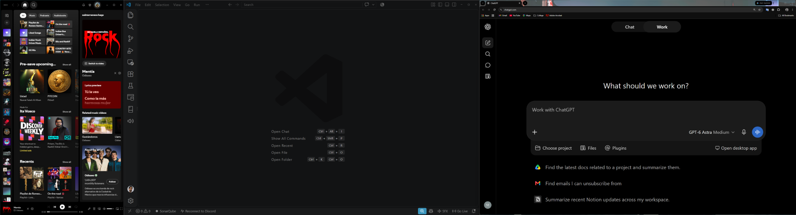
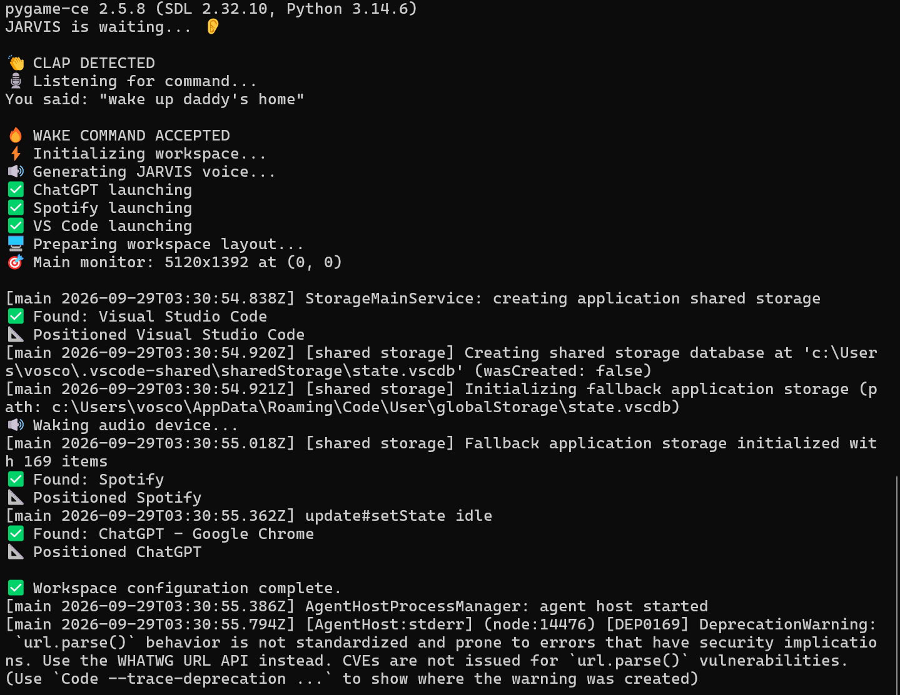

# JARVIS — My Own Little Stark Workspace 🤖

> “Welcome home, sir. Systems online. Workspace ready.”

A fun, Iron Man-inspired Python side project that starts my desktop workspace with a clap and a voice phrase. JARVIS opens Spotify, Visual Studio Code, and ChatGPT, arranges their windows, and greets me out loud.

## Why I built this

I'm an Iron Man fan, and I've always wanted my own JARVIS. Building a small assistant for my everyday setup felt like a fun place to start. A clap, a familiar wake phrase, and my workspace coming to life gives me a little of that Tony Stark feeling at my desk.

While building this, I applied what I've learned in my Python and programming courses: functions, conditions, loops, working with libraries, and breaking a task into smaller steps. I also used AI to work more efficiently, help troubleshoot issues, and better understand the code and unfamiliar concepts as I went. This project has been a way to put those skills into practice while building something I actually enjoy using.

## See it in action



My setup uses an ultrawide primary monitor. You can change the layout proportions for your own screen.

## What it does

- Listens for a loud sound, such as a clap, through the microphone.
- Records a short voice command and checks for the wake phrase.
- Opens Spotify, VS Code, and ChatGPT in the default browser.
- Positions their windows across the primary monitor's usable area.
- Generates and plays a spoken greeting, with a quiet audio pre-warm tone for slow-to-wake speakers.

**Current version:** two claps followed by a voice phrase. The script handles one attempt, then exits. Two-clap detection, background listening, and an executable are future improvements.

## Getting started

### 1. Get the files

Download and extract the project ZIP. Keep `main.py`, `requirements.txt`, and the `docs` folder together. Open PowerShell in the extracted folder containing `main.py`.

### 2. Check the requirements

You need:

- A Windows PC. The app-launching and window-management code uses Windows APIs.
- Python installed with pip and the Windows `py` launcher available.
- A microphone and audio output device enabled in Windows.
- Internet access for speech recognition and voice generation.
- VS Code and Spotify installed to use the default app configuration.

Check Python from PowerShell:

```powershell
py --version
```

If `py` is unavailable but `python --version` works, use `python` in place of `py` in the next step.

### 3. Create an environment and install dependencies

Run these commands from the project folder:

```powershell
py -m venv .venv
.\.venv\Scripts\python.exe -m pip install -r requirements.txt
```

These commands use the environment directly, so PowerShell environment activation is optional.

### 4. Set your VS Code path

Open `main.py` and find `VSCODE_SHORTCUT` near the top. Set it to an existing VS Code shortcut or executable on your PC:

```python
VSCODE_SHORTCUT = Path(r"C:\Users\YourName\Desktop\Visual Studio Code.lnk")
```

Replace the example with your actual path. If your Desktop is inside OneDrive, include that in the path. The `r` before the quoted path tells Python to treat backslashes literally.

The supplied default points to `Desktop\Visual Studio Code.lnk` inside your user folder. It only works if that shortcut exists there.

### 5. Run JARVIS

Make sure Windows allows microphone access for desktop apps, then run:

```powershell
.\.venv\Scripts\python.exe main.py
```

If you already have the dependencies installed in your active Python environment, you can also run:

```powershell
python main.py
```

1. Wait for **“JARVIS is waiting...”**.
2. Clap once near the microphone.
3. When **“Listening for command...”** appears, say **“wake up daddy's home”** within the four-second recording window.
4. JARVIS checks the phrase, launches the apps, arranges their windows, and speaks the greeting.

Press **Ctrl+C** while waiting for a clap to stop the script. Run the command again for another attempt if recognition fails or the phrase is rejected.

### Example terminal output

This run shows clap detection, the accepted voice command, and successful window positioning. Extra VS Code messages can appear in the same terminal.



## Make it your own

Most settings are grouped near the top of `main.py`. Save your changes and restart the script to use them.

### Wake phrase and greeting

For example, change the activation words and response to:

```python
WAKE_WORDS = ("jarvis", "start", "workspace")
GREETING = "At your service. Let's get to work."
```

Then say **“Jarvis, start my workspace.”** Use lowercase text in `WAKE_WORDS`: recognized speech is converted to lowercase. Every configured word or phrase must appear somewhere in the transcript; their order is not checked.

### Apps and window titles

| Setting | Purpose |
| --- | --- |
| `VSCODE_SHORTCUT` | Path to your VS Code shortcut or executable. |
| `CHATGPT_URL` | Website opened in your default browser. |
| `SPOTIFY_URI` | URI used to launch Spotify; defaults to `spotify:`. |
| `SPOTIFY_WINDOW_TITLE` | Partial title used to find the Spotify window. |
| `VSCODE_WINDOW_TITLE` | Partial title used to find the VS Code window. |
| `CHATGPT_WINDOW_TITLE` | Partial title used to find the ChatGPT browser window. |

Window-title matching ignores case. If you change a website, update its window-title setting too. To substitute a different desktop app, edit its launch call in `launch_apps()` and update the corresponding window title. Adding more than three apps also requires updating `arrange_windows()`.

### Screen layout

The default layout uses the **primary monitor only**:

| App | Position | Configured width |
| --- | --- | --- |
| Spotify | Left | 10% |
| VS Code | Middle | 50% |
| ChatGPT | Right | Remaining 40% |

For a more balanced layout on a smaller screen, try:

```python
SPOTIFY_WIDTH_FRACTION = 0.25
VSCODE_WIDTH_FRACTION = 0.40
```

ChatGPT then receives the remaining 35%. Keep both values positive and their sum below `1.0`. Some apps enforce a minimum window size, so the final appearance can vary. The primary monitor's work area excludes space reserved for the taskbar.

### Microphone and voice

| Setting | What to adjust |
| --- | --- |
| `CLAP_THRESHOLD` | Increase it if everyday noise triggers the script; decrease it if claps are missed. Default: `0.6`. |
| `JARVIS_VOICE` | Edge TTS voice identifier. Default: `en-GB-RyanNeural`. |
| `VOICE_RATE` | Speech speed. Default: `+7%`. |
| `VOICE_PITCH` | Voice pitch. Default: `-12Hz`. |
| `VOICE_VOLUME` | Generated speech volume adjustment. Default: `+0%`. |
| `AUDIO_PREWARM_SECONDS` | Duration of the quiet tone before speech. Default: `1.2` seconds. |
| `AUDIO_PREWARM_VOLUME` | Tone amplitude, rather than a percentage. Default: `300`. Adjust cautiously; the tone may be audible. |

The script uses the default input and output devices. Start by checking your Windows audio settings if it listens or plays through the wrong device.

## What I practiced

- Organizing an automation workflow into functions.
- Using loops and conditions to respond to microphone input.
- Handling NumPy audio arrays and converting recordings to 16-bit PCM.
- Connecting speech recognition, speech generation, and audio playback libraries.
- Using threads so speech playback and app startup can overlap.
- Calling Windows APIs to find, restore, move, and resize windows.
- Handling failures and cleaning up temporary audio files.

## Troubleshooting

| Problem | What to check |
| --- | --- |
| `ModuleNotFoundError` | Install `requirements.txt` using the same Python environment that runs `main.py`. |
| No clap detected | Check microphone permissions and your default input device. Lower `CLAP_THRESHOLD` gradually. |
| Keyboard taps or other sounds trigger JARVIS | Raise the threshold or reduce nearby noise. Detection currently checks peak volume, so it cannot reliably distinguish claps from other sharp sounds. |
| Voice command rejected | Check the printed transcript. Speak during the four-second recording window and use all configured wake words. |
| Speech recognition request fails | Check internet connectivity and try again. Recognition depends on an online service. |
| VS Code does not open | Check that `VSCODE_SHORTCUT` points to a real `.lnk` or `.exe` file. |
| Spotify does not open | Confirm that Spotify is installed and Windows can open a `spotify:` URI. |
| A window does not move | Check its visible title against the corresponding setting. The watcher searches for roughly ten seconds. Make the ChatGPT tab active so its title appears in the browser window. |
| The wrong window moves | Multiple windows may match the same title. Close extras or use a more specific title substring. |
| Greeting is silent or cut off | Check output device, volume, internet access, and printed voice errors. Adjust the pre-warm duration if your speakers wake slowly. |

## Project files

| File | Purpose |
| --- | --- |
| `main.py` | Commented Python script, including configuration and the complete launch flow. |
| `requirements.txt` | Python dependencies. |
| `.gitignore` | Excludes virtual environments, caches, and local editor files from Git. |
| `docs/workspace-layout.png` | Desktop preview. |
| `docs/running-jarvis.png` | Terminal example. |
| `README.md` | Project story, setup, usage, and customization instructions. |

## Next on the workbench

- [ ] Two-clap activation with timing and a cooldown.
- [ ] Continuous background listening.
- [ ] A system tray icon with pause and exit controls.
- [ ] A Windows executable.
- [ ] More flexible app and monitor layouts.

## Audio and online services

While waiting for a clap, the script checks microphone audio locally. After a trigger, it records four seconds and sends that clip to Google's speech recognition service. Edge TTS uses an online service to generate the greeting. The script does not intentionally save microphone recordings; it creates a temporary greeting MP3 and attempts to delete it after playback.

---

Built for fun, learning, and a little Iron Man energy at my desk. This is an unofficial fan-inspired project.
